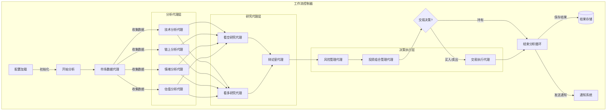

# 加密货币交易代理系统使用指南 | Crypto Trading Agent Guide

[English](README_EN.md) | 中文

这个文档提供了加密货币交易代理系统的详细使用说明，包括安装、配置、运行以及各种功能的使用方法。

## 目录

1. [系统概述](#系统概述)
2. [安装](#安装)
3. [系统配置](#系统配置)
4. [基本用法](#基本用法)
5. [API 接口](#API接口)
6. [代理模块](#代理模块)
7. [回测系统](#回测系统)
8. [自定义和扩展](#自定义和扩展)
9. [常见问题与排错](#常见问题与排错)

## 系统概述

加密货币交易代理系统是一个模块化、可扩展的自动化交易框架，集成了多种分析技术，包括：

- 技术分析（价格和成交量模式）
- 链上分析（区块链数据）
- 市场情绪分析（社交媒体和新闻）
- 加密资产估值分析
- 风险管理和资金管理
- 投资组合优化和交易执行

系统采用多代理协作架构，各个专业代理分工合作，结合多种数据源和分析方法，提供全面的市场洞察。

## 安装

### 前提条件

- Python 3.8 或更高版本
- pip 包管理工具
- 交易所 API 密钥（如需连接实盘交易）

### 安装步骤

1. 克隆代码库

```bash
git clone https://github.com/your-username/crypto-trading-agent.git
cd crypto-trading-agent
```

2. 创建虚拟环境（推荐）

```bash
python -m venv venv
source venv/bin/activate  # Linux/Mac
venv\Scripts\activate     # Windows
```

3. 安装依赖

```bash
pip install -r requirements.txt
```

**注意**: 如果在安装过程中遇到 `ModuleNotFoundError: No module named 'yaml'` 错误，请尝试手动安装 `PyYAML` 库：

```bash
pip install pyyaml
```

如果仍然遇到依赖问题，可以尝试手动安装以下常用库：

```bash
pip install pyyaml pandas numpy matplotlib ccxt tweepy langchain-core requests
```

4. 设置环境

```bash
python main.py --setup
```

## 系统配置

系统使用 JSON 或 YAML 格式的配置文件管理设置。可以使用以下命令生成默认配置：

```bash
python main.py --generate-config configs/default_config.json
```

### 主要配置项

- `mode`: 运行模式（'analysis', 'trading', 'backtest'）
- `symbol`: 交易对（例如 'BTC/USDT'）
- `exchange_id`: 交易所 ID（例如 'binance'）
- `portfolio`: 初始投资组合设置
- `execution_mode`: 执行模式（'simulation', 'paper', 'live'）
- `api_keys`: 各种 API 密钥设置
- `indicators`: 各类指标的权重和参数设置
- `risk_management`: 风险管理参数
- `backtesting`: 回测参数设置

详细的配置选项说明请参考 `configs/default_config.json` 文件中的注释。

## 基本用法

### 分析模式

只进行市场分析，不执行交易:

```bash
python main.py --config configs/your_config.json --mode analysis
```

### 交易模式

进行市场分析并执行交易决策:

```bash
python main.py --config configs/your_config.json --mode trading
```

### 回测模式

使用历史数据测试交易策略:

```bash
python main.py --config configs/your_config.json --mode backtest
```

### 命令行参数

- `--config`: 指定配置文件路径
- `--mode`: 运行模式 (analysis, trading, backtest)
- `--symbol`: 交易对 (例如 BTC/USDT)
- `--generate-config`: 生成默认配置文件
- `--setup`: 设置环境

## API 接口

本系统集成了多个外部 API，为交易代理提供丰富的数据和分析服务：

### 交易所 API

- **Binance API**: 用于获取市场数据、交易执行和账户信息
  - 提供实时价格、历史 K 线数据、订单簿等
  - 支持模拟交易和实盘交易

### 新闻和情感分析 API

- **RapidAPI Crypto News**: 用于获取加密货币相关新闻

  - 来源: crypto-news51.p.rapidapi.com
  - 功能: 检索与特定加密货币相关的最新新闻文章
  - 需要: RAPIDAPI_KEY (在.env 文件中配置)

- **Google Gemini API**: 用于新闻情感分析
  - 模型: gemini-1.5-flash
  - 功能: 分析新闻文章情感 (积极/消极/中性)
  - 需要: GEMINI_API_KEY (在.env 文件中配置)

### 市场数据 API

- **CoinMarketCap API**: 用于获取市场数据和 DeFi 信息

  - 功能: 获取 DEX 网络列表、跨链市场数据等
  - 需要: COINMARKETCAP_API_KEY (在.env 文件中配置)

- **GeckoTerminal API**: 用于获取链上和 DEX 数据
  - 功能: 提供链上交易数据和 DEX 活动

### API 密钥配置

所有 API 密钥需要在项目根目录的`.env`文件中配置，格式如下:

```
# 交易所API密钥
BINANCE_API_KEY=your_binance_api_key
BINANCE_API_SECRET=your_binance_api_secret

# RapidAPI密钥 (用于Crypto News API)
RAPIDAPI_KEY=your_rapidapi_key

# CoinMarketCap API密钥
COINMARKETCAP_API_KEY=your_coinmarketcap_api_key

# Google Gemini API密钥
GEMINI_API_KEY=your_gemini_api_key
```

**注意**: 请妥善保管您的 API 密钥，不要将它们公开或提交到版本控制系统中。

## 代理模块

系统由多个专业代理组成，各司其职：

### 1. 市场数据代理

- 收集交易所的价格、成交量数据
- 获取链上数据和市场情绪指标
- 预处理数据，供其他代理使用

### 2. 技术分析代理

提供全面的技术分析，结合多种交易策略：

- 趋势跟踪（EMA, ADX 等）
- 均值回归（RSI, 布林带等）
- 动量策略（MACD, 价格动量等）
- 波动率分析
- 支撑/阻力位识别
- 量价关系分析

### 3. 链上分析代理

分析区块链数据，评估网络健康和用户活动：

- 网络活动分析（活跃地址，交易量）
- 网络安全性分析（算力/质押率）
- 持币分布分析
- 链上估值指标（NVT, MVRV 等）

### 4. 情绪分析代理

分析市场情绪和社交媒体趋势：

- KOL 推文分析
- 社区情绪评估
- 新闻情绪分析
- 恐慌/贪婪指数

### 5. 估值分析代理

为加密资产提供估值分析：

- Bitcoin 特有估值模型（S2F, Thermocap 等）
- Ethereum 特有估值模型（Fee 模型, 质押收益率等）
- 通用网络价值分析
- 相对估值分析

### 6. 看多/看空研究代理

整合各类分析，构建投资论点：

- 看多研究代理：寻找积极因素和买入信号
- 看空研究代理：寻找风险因素和卖出信号

### 7. 辩论室代理

整合看多/看空观点，形成均衡结论：

- 评估双方论点质量
- 权衡不同因素
- 形成最终信号和信心水平

### 8. 风险管理代理

评估市场风险并设置交易限制：

- 计算波动率、VaR 等风险指标
- 设置最大仓位大小
- 执行风险相关的交易约束

### 9. 投资组合管理代理

制定最终交易决策：

- 整合各代理信号
- 确定交易动作和数量
- 考虑当前投资组合状况

### 10. 交易执行代理

负责执行交易：

- 执行实际或模拟交易
- 记录交易历史
- 更新投资组合状态

## 回测系统

回测系统允许使用历史数据测试交易策略：

```bash
python main.py --config configs/backtest_config.json --mode backtest
```

回测功能包括：

- 历史价格数据加载
- 模拟交易执行
- 性能指标计算（收益率、夏普比率、最大回撤等）
- 图表生成和可视化

## 自定义和扩展

系统设计为可扩展的架构，可以通过以下方式自定义：

### 添加新的分析代理

1. 在`src/agents/`目录下创建新的代理模块
2. 实现代理的分析逻辑
3. 在`workflow/controller.py`中注册新代理

### 自定义交易策略

1. 在技术分析代理中添加新的策略
2. 调整各策略的权重配置

### 添加新的数据源

1. 在`src/tools/`目录下添加新的 API 连接器
2. 在市场数据代理中集成新数据源

## 常见问题与排错

### API 连接问题

**问题**: 无法连接到交易所 API
**解决方案**:

- 检查 API 密钥配置
- 确认网络连接
- 查看交易所 API 状态

### 数据不足问题

**问题**: 某些分析显示数据不足
**解决方案**:

- 确保选择了流动性足够的交易对
- 增加历史数据范围
- 降低某些指标的最小数据要求

### 交易执行失败

**问题**: 交易执行失败
**解决方案**:

- 检查账户余额
- 确认交易所限制
- 验证价格和数量是否符合交易所要求

### 性能问题

**问题**: 系统运行缓慢
**解决方案**:

- 减少使用的指标数量
- 降低数据请求频率
- 优化数据处理逻辑

## 致谢 | Acknowledgements

本项目的开发受到以下优秀项目的启发：

1. [ai-hedge-fund](https://github.com/virattt/ai-hedge-fund) - 一个基于 AI 的对冲基金系统，为本项目的多代理架构和决策流程提供了重要参考。

2. [A_Share_investment_Agent](https://github.com/24mlight/A_Share_investment_Agent) - 一个针对 A 股市场的 AI 投资系统，为本项目的风险管理和投资组合管理提供了宝贵思路。

感谢这些项目的作者为开源社区做出的贡献。

## 语言支持 | Language Support

本系统支持中文和英文两种语言模式：

1. **中文模式**（默认）：

```bash
python main.py --ticker BTC/USDT --lang zh
```

2. **英文模式**：

```bash
python main.py --ticker BTC/USDT --lang en
```

语言设置会影响：

- 系统输出信息
- 分析报告内容
- 日志记录
- 错误提示

## 项目结构

```
crypto-trading-agent/
├── main.py                           # 主程序入口
├── requirements.txt                  # 项目依赖
├── README.md                         # 项目说明
├── USAGE.md                          # 使用指南
├── src/                             # 源代码目录
│   ├── agents/                       # 代理模块
│   │   ├── __init__.py
│   │   ├── state.py                  # 状态管理
│   │   ├── market_data.py            # 市场数据代理
│   │   ├── technicals.py             # 技术分析代理
│   │   ├── onchain_analysis.py       # 链上分析代理
│   │   ├── sentiment.py              # 情绪分析代理
│   │   ├── valuation.py              # 估值分析代理
│   │   ├── researcher_bull.py        # 看多研究代理
│   │   ├── researcher_bear.py        # 看空研究代理
│   │   ├── debate_room.py            # 辩论室代理
│   │   ├── risk_manager.py           # 风险管理代理
│   │   ├── portfolio_manager.py      # 投资组合管理代理
│   │   └── execution.py              # 交易执行代理
│   ├── tools/                        # 工具模块
│   │   ├── __init__.py
│   │   ├── crypto_api.py             # 加密货币API工具
│   │   ├── openrouter_config.py      # LLM配置
│   │   └── notification.py           # 通知工具
│   ├── backtest/                     # 回测系统
│   │   ├── __init__.py
│   │   ├── backtester.py             # 回测引擎
│   │   ├── strategies/               # 策略集合
│   │   │   ├── __init__.py
│   │   │   ├── ema_cross.py          # EMA交叉策略示例
│   │   │   └── rsi_strategy.py       # RSI策略示例
│   │   └── performance.py            # 性能分析工具
│   └── utils/                        # 工具函数
│       ├── __init__.py
│       └── logging_config.py         # 日志配置
├── workflow/                         # 工作流控制
│   ├── __init__.py
│   └── controller.py                 # 工作流控制器
├── configs/                          # 配置文件
│   ├── default_config.json           # 默认配置
│   └── example_config.json           # 示例配置
├── data/                             # 数据文件夹
│   ├── market_data/                  # 市场数据
│   ├── onchain_data/                 # 链上数据
│   └── sentiment_data/               # 情绪数据
├── logs/                             # 日志文件夹
└── results/                          # 结果输出文件夹
    ├── analysis/                     # 分析结果
    ├── trading/                      # 交易结果
    └── backtest/                     # 回测结果
```

## 工作流程图


