# Crypto Trading Agent Guide

[中文](README.md) | English

This document provides detailed instructions for the cryptocurrency trading agent system, including installation, configuration, operation, and various features.

## Table of Contents

1. [System Overview](#system-overview)
2. [Installation](#installation)
3. [System Configuration](#system-configuration)
4. [Basic Usage](#basic-usage)
5. [Agent Modules](#agent-modules)
6. [Backtesting System](#backtesting-system)
7. [Customization and Extension](#customization-and-extension)
8. [Troubleshooting](#troubleshooting)

## System Overview

The cryptocurrency trading agent system is a modular, extensible automated trading framework that integrates various analysis techniques, including:

- Technical Analysis (price and volume patterns)
- On-chain Analysis (blockchain data)
- Market Sentiment Analysis (social media and news)
- Crypto Asset Valuation
- Risk Management and Fund Management
- Portfolio Optimization and Trade Execution

The system adopts a multi-agent collaborative architecture, where specialized agents work together, combining multiple data sources and analysis methods to provide comprehensive market insights.

## Installation

### Prerequisites

- Python 3.8 or higher
- pip package manager
- Exchange API keys (for live trading)

### Installation Steps

1. Clone the repository

```bash
git clone https://github.com/your-username/crypto-trading-agent.git
cd crypto-trading-agent
```

2. Create virtual environment (recommended)

```bash
python -m venv venv
source venv/bin/activate  # Linux/Mac
venv\Scripts\activate     # Windows
```

3. Install dependencies

```bash
pip install -r requirements.txt
```

**Note**: If you encounter `ModuleNotFoundError: No module named 'yaml'`, try installing PyYAML manually:

```bash
pip install pyyaml
```

If you still encounter dependency issues, try installing these common libraries:

```bash
pip install pyyaml pandas numpy matplotlib ccxt tweepy langchain-core requests
```

4. Setup environment

```bash
python main.py --setup
```

## System Configuration

The system uses JSON or YAML format configuration files. Generate default config with:

```bash
python main.py --generate-config configs/default_config.json
```

### Main Configuration Items

- `mode`: Running mode ('analysis', 'trading', 'backtest')
- `symbol`: Trading pair (e.g., 'BTC/USDT')
- `exchange_id`: Exchange ID (e.g., 'binance')
- `portfolio`: Initial portfolio settings
- `execution_mode`: Execution mode ('simulation', 'paper', 'live')
- `api_keys`: Various API key settings
- `indicators`: Indicator weights and parameters
- `risk_management`: Risk management parameters
- `backtesting`: Backtesting parameters

For detailed configuration options, refer to the comments in `configs/default_config.json`.

## Basic Usage

### Analysis Mode

For market analysis only, without trade execution:

```bash
python main.py --config configs/your_config.json --mode analysis
```

### Trading Mode

For market analysis and trade execution:

```bash
python main.py --config configs/your_config.json --mode trading
```

### Backtesting Mode

For testing trading strategies with historical data:

```bash
python main.py --config configs/your_config.json --mode backtest
```

### Command Line Arguments

- `--config`: Specify configuration file path
- `--mode`: Running mode (analysis, trading, backtest)
- `--symbol`: Trading pair (e.g., BTC/USDT)
- `--generate-config`: Generate default configuration file
- `--setup`: Setup environment

## Agent Modules

The system consists of multiple specialized agents:

[Detailed agent descriptions omitted for brevity, same structure as Chinese version]

## Backtesting System

The backtesting system allows testing trading strategies using historical data:

```bash
python main.py --config configs/backtest_config.json --mode backtest
```

Features include:

- Historical price data loading
- Trade simulation
- Performance metrics calculation (returns, Sharpe ratio, max drawdown, etc.)
- Chart generation and visualization

## Customization and Extension

The system is designed to be extensible through:

### Adding New Analysis Agents

1. Create new agent module in `src/agents/`
2. Implement analysis logic
3. Register new agent in `workflow/controller.py`

### Customizing Trading Strategies

1. Add new strategies in technical analysis agent
2. Adjust strategy weights

### Adding New Data Sources

1. Add new API connector in `src/tools/`
2. Integrate new data source in market data agent

## Troubleshooting

### API Connection Issues

**Problem**: Cannot connect to exchange API
**Solution**:

- Check API key configuration
- Verify network connection
- Check exchange API status

### Insufficient Data

**Problem**: Some analyses show insufficient data
**Solution**:

- Ensure sufficient liquidity for selected trading pair
- Increase historical data range
- Lower minimum data requirements

### Trade Execution Failure

**Problem**: Trade execution fails
**Solution**:

- Check account balance
- Verify exchange limits
- Validate price and quantity requirements

### Performance Issues

**Problem**: System runs slowly
**Solution**:

- Reduce number of indicators
- Lower data request frequency
- Optimize data processing logic

## Acknowledgements

This project was inspired by these excellent projects:

1. [ai-hedge-fund](https://github.com/virattt/ai-hedge-fund) - An AI-based hedge fund system that provided important references for our multi-agent architecture and decision-making process.

2. [A_Share_investment_Agent](https://github.com/24mlight/A_Share_investment_Agent) - An AI investment system for A-Share market that provided valuable insights for our risk management and portfolio management.

Thanks to the authors of these projects for their contributions to the open source community.

## Language Support

The system supports both English and Chinese language modes:

1. **English Mode**:

```bash
python main.py --ticker BTC/USDT --lang en
```

2. **Chinese Mode**:

```bash
python main.py --ticker BTC/USDT --lang zh
```

Language settings affect:

- System output messages
- Analysis reports
- Log entries
- Error messages

## Project Structure

```
crypto-trading-agent/
├── main.py                           # Main program entry
├── requirements.txt                  # Project dependencies
├── README.md                         # Project documentation
├── USAGE.md                          # Usage guide
├── src/                             # Source code directory
│   ├── agents/                       # Agent modules
│   │   ├── __init__.py
│   │   ├── state.py                  # State management
│   │   ├── market_data.py            # Market data agent
│   │   ├── technicals.py             # Technical analysis agent
│   │   ├── onchain_analysis.py       # On-chain analysis agent
│   │   ├── sentiment.py              # Sentiment analysis agent
│   │   ├── valuation.py              # Valuation analysis agent
│   │   ├── researcher_bull.py        # Bullish researcher agent
│   │   ├── researcher_bear.py        # Bearish researcher agent
│   │   ├── debate_room.py            # Debate room agent
│   │   ├── risk_manager.py           # Risk management agent
│   │   ├── portfolio_manager.py      # Portfolio management agent
│   │   └── execution.py              # Execution agent
│   ├── tools/                        # Utility tools
│   │   ├── __init__.py
│   │   ├── crypto_api.py             # Crypto API tools
│   │   ├── openrouter_config.py      # LLM configuration
│   │   └── notification.py           # Notification tools
│   ├── backtest/                     # Backtesting system
│   │   ├── __init__.py
│   │   ├── backtester.py             # Backtesting engine
│   │   ├── strategies/               # Strategy collection
│   │   │   ├── __init__.py
│   │   │   ├── ema_cross.py          # EMA cross strategy example
│   │   │   └── rsi_strategy.py       # RSI strategy example
│   │   └── performance.py            # Performance analysis tools
│   └── utils/                        # Utility functions
│       ├── __init__.py
│       └── logging_config.py         # Logging configuration
├── workflow/                         # Workflow control
│   ├── __init__.py
│   └── controller.py                 # Workflow controller
├── configs/                          # Configuration files
│   ├── default_config.json           # Default configuration
│   └── example_config.json           # Example configuration
├── data/                             # Data directory
│   ├── market_data/                  # Market data
│   ├── onchain_data/                 # On-chain data
│   └── sentiment_data/               # Sentiment data
├── logs/                             # Log directory
└── results/                          # Results directory
    ├── analysis/                     # Analysis results
    ├── trading/                      # Trading results
    └── backtest/                     # Backtesting results
```

## Workflow Diagram

```mermaid
flowchart TD
    subgraph Workflow Controller
        Config[Load Config] --> |Initialize| Start
        Start[Start Analysis] --> MarketData

        %% Data Collection Phase
        MarketData[Market Data Agent] --> |Collect Data| Technical
        MarketData --> |Collect Data| Onchain
        MarketData --> |Collect Data| Sentiment
        MarketData --> |Collect Data| Valuation

        %% Analysis Phase
        subgraph Analysis Agents
            Technical[Technical Analysis]
            Onchain[On-chain Analysis]
            Sentiment[Sentiment Analysis]
            Valuation[Valuation Analysis]
        end

        %% Research Phase
        Technical --> BearResearch
        Onchain --> BearResearch
        Sentiment --> BearResearch
        Valuation --> BearResearch

        Technical --> BullResearch
        Onchain --> BullResearch
        Sentiment --> BullResearch
        Valuation --> BullResearch

        subgraph Research Agents
            BearResearch[Bearish Research]
            BullResearch[Bullish Research]
            DebateRoom[Debate Room]
        end

        BearResearch --> DebateRoom
        BullResearch --> DebateRoom

        %% Decision Phase
        DebateRoom --> RiskManagement

        subgraph Decision & Execution
            RiskManagement[Risk Management]
            PortfolioManagement[Portfolio Management]
            Execution[Trade Execution]
        end

        RiskManagement --> PortfolioManagement
        PortfolioManagement --> Decision{Trade Decision?}

        %% Execution Phase
        Decision -->|Buy/Sell| Execution
        Decision -->|Hold| End

        Execution --> End[End Analysis Loop]

        %% Result Feedback
        End --> |Save Results| Results[(Results Storage)]
        End --> |Send Notification| Notification[Notification System]
    end
```


